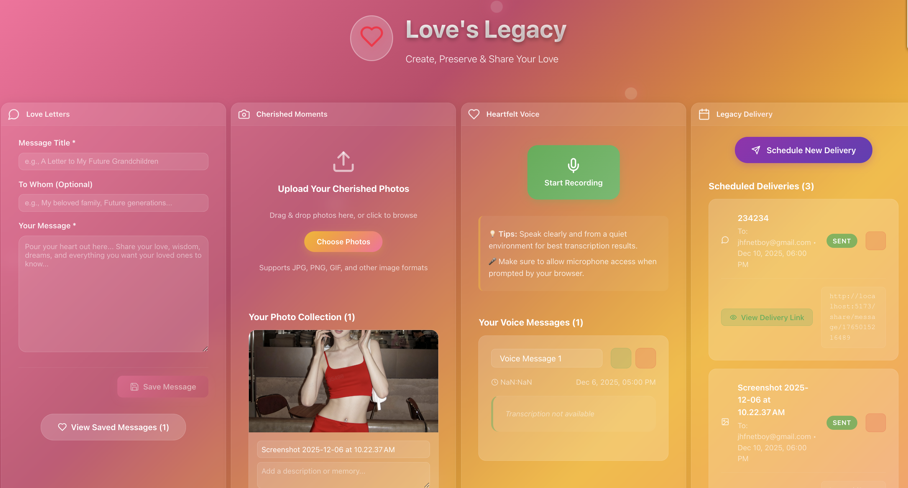

# 💖 Love's Legacy

A compassionate digital time capsule for leaving messages, photos, and memories for loved ones. Create warm legacy capsules to preserve important words, precious moments, and inner thoughts for future generations.

**📖 [中文文档](#chinese-documentation)**

## 🎯 Mission

Love's Legacy is dedicated to providing a warm, safe digital space for people who wish to leave love and memories when they depart. Through modern technology, we help people:

- **💌 Share loving words** - Write warm letters and precious memories
- **📸 Preserve precious moments** - Upload and organize life's beautiful photos
- **🎤 Record heartfelt voices** - Leave voice messages and personal stories
- **📅 Schedule delivery** - Arrange delivery at important future moments

## 📱 App Preview



*A beautiful, compassionate interface for creating digital legacy capsules*

## 🚀 Quick Start

### Prerequisites
- Node.js >= 18.0.0
- pnpm >= 8.0.0

### Deployment Options

#### 🌐 **Vercel (Recommended)**
For easy deployment with global CDN:

```bash
# Quick deploy to Vercel
./deploy-vercel.sh

# Or manually:
cd love-legacy
vercel --prod
```

See [Vercel Deployment Guide](love-legacy/VERCEL_DEPLOY.md) for details.

#### 🖥️ **Local Development**

### Launch Application

```bash
# Clone the project
git clone <repository-url>
cd 2025-Cursor-hackthon

# Simplest way - One-click launch
./start.sh

# start.sh will automatically:
# - Check system dependencies (Node.js, pnpm, curl)
# - Clean up old processes (ports 3000 and 5173)
# - Install project dependencies
# - Start backend service (port 3000)
# - Start frontend application (port 5173)
# - Wait for services to be ready and display status

# Or manual way:

# Install all dependencies
pnpm install:all

# Configure API key (for speech-to-text functionality)
echo "ELEVENLABS_API_KEY=your_actual_api_key_here" > backend/.env

# Start full application (frontend + backend)
pnpm dev:full

# Or start separately:
# Terminal 1: pnpm dev:backend  # Backend service (port 3000)
# Terminal 2: pnpm dev          # Frontend app (port 5173)

# Access application
# 💖 Love's Legacy: http://localhost:5173
# 💚 Backend health check: http://localhost:3000/health
#
# ✨ All features are now in one page, no tab switching needed!

# Stop services
# Press Ctrl+C in the terminal running start.sh, or run:
pkill -f "pnpm dev" && pkill -f "node.*server.js"
```

### Getting ElevenLabs API Key

Love's Legacy uses ElevenLabs Speech-to-Text API to transcribe voice recordings:

#### 🎯 Recommended Setup (Full Features)
**Requires API key with speech_to_text permissions**

#### Step 1: Register ElevenLabs Account
1. Visit [elevenlabs.io](https://elevenlabs.io/) and create account
2. Verify email and log in

#### Step 2: Upgrade Account for Speech-to-Text
1. Visit [ElevenLabs Pricing](https://elevenlabs.io/pricing)
2. Upgrade to **Creator** plan ($22/month) or higher
3. Ensure account includes **Speech-to-Text** feature

#### Step 3: Get API Key
1. Click avatar in top-right → "Profile"
2. Scroll to "API Key" section
3. Click "Create" to generate new API key

#### Step 4: Configure Environment Variables
1. Open `backend/.env` file
2. Replace with your actual API key:
   ```
   ELEVENLABS_API_KEY=sk_1234567890abcdef...your_real_key
   PORT=3000
   ```

#### 🔄 Alternative (Development Mode)
If you don't have proper API key, system will automatically use **mock transcription**:
- ✅ Recording feature fully available
- ✅ Shows sample transcription text
- ✅ Provides upgrade prompts
- ⚠️ Transcription content is sample text

#### Verify Configuration
Restart backend service, you should see:
```
✅ ElevenLabs client initialized successfully
```

If you see permission errors, system will automatically switch to mock mode.

### Other Commands

```bash
# Build production version
pnpm build

# Preview build results
pnpm preview

# Code quality check
pnpm lint
```

## ✨ Features

### 🏠 **Single Page Compact Layout**
- All features integrated in one page, no tab switching
- 📱 Responsive grid: mobile stacked, tablet 2 columns, desktop 4 columns
- ⚡ Instant operations, no page navigation
- 🎯 Optimized compact design, maximum space efficiency
- 🔄 Real-time sync, independent feature areas
- 💖 Beautiful heart logo, emotionally rich design

### 🔗 **Share Features**
- Directly accessible share links (`/share/{type}/{id}`)
- View content without account required
- Secure local content access
- Support message, voice, and photo sharing

### 💌 **Loving Messages** ✅ Implemented
- Write warm words and precious memories
- Rich text editor, supports long articles
- Save to local storage, support edit and delete
- Beautiful message card display

### 📸 **Precious Memories** ✅ Implemented
- Drag & drop upload or click to select photos
- Add titles and descriptions
- Grid layout display, hover preview support
- Full-screen modal for viewing large images
- Photo deletion confirmation

### 🎤 **Heartfelt Voices** ✅ Implemented
- Native browser recording functionality
- Real-time recording duration display and visual indicators
- ElevenLabs Speech-to-Text API integration
- Automatic transcription and text display
- Play/pause recording controls
- Recording deletion confirmation

### 📅 **Future Delivery** ✅ Implemented
- Calendar and time pickers
- Schedule delivery at important future moments
- Generate directly accessible share links
- Local storage and scheduled task management
- Form validation and error handling
- *Note: Emails are simulated for demo - they appear to send successfully*

### 🎨 **Warm Interface**
- Design full of love and care
- Warm pink-gold gradient colors
- Heart animations and smooth transitions
- 📱 Adaptive layout: single page grid system
- 🖥️ Desktop 4-column layout, tablet 2 columns, mobile stacked

## 🛠️ Tech Stack

- **Frontend Framework**: React 18 + TypeScript
- **Build Tool**: Vite 6
- **Animation Engine**: Framer Motion
- **Icon Library**: Lucide React
- **Recording**: Web Audio API
- **State Management**: React Hooks
- **Styling**: CSS-in-JS + Responsive Design
- **Package Manager**: pnpm
- **Code Quality**: ESLint + TypeScript
- **Design Philosophy**: Warm pink-gold gradients, heart animations, and meaningful SVG logo

## 📁 Project Structure

```
loves-legacy/
├── love-legacy/          # Main app (single page layout)
│   ├── src/
│   │   ├── components/         # Feature components
│   │   │   ├── MessageComposer.tsx  # 💌 Loving messages
│   │   │   ├── PhotoManager.tsx     # 📸 Precious memories
│   │   │   ├── VoiceRecorder.tsx    # 🎤 Heartfelt voices
│   │   │   └── ScheduleManager.tsx  # 📅 Future delivery
│   │   ├── ShareView.tsx       # 🔗 Share pages
│   │   ├── App.tsx            # Main app (single page)
│   │   ├── App.css            # Compact layout styles
│   │   └── index.css          # Global styles
│   ├── public/
│   │   └── heart-icon.svg     # Heart icon
│   └── package.json
├── docs/                      # Project documentation
│   ├── Solution.md
│   ├── Features.md
│   ├── Plan.md
│   ├── Changes.md
│   └── Deploy.md
└── README.md                  # Project documentation
```

## 📚 Documentation

Detailed documentation available in [docs/](docs/) directory.

## 🌟 Design Philosophy

**Love's Legacy** design philosophy is based on:

- **❤️ Love & Warmth**: Pink-gold color scheme, heart icons, gentle animations
- **🌟 Hope & Light**: Bright interface, positive visual language
- **🔗 Connection & Continuity**: Help bridge time to deliver loving messages
- **🎨 Beauty & Care**: Elegant design, focus on user emotional experience
- **♾️ Eternal Legacy**: Logo contains infinity symbols and bridge elements, symbolizing eternal love legacy

### 🎨 Logo Design Philosophy

**Love's Legacy** logo contains profound product philosophy:

- **💖 Heart Outline**: Represents the core of love and emotion
- **♾️ Infinity Symbol**: Symbolizes eternal legacy and infinite continuation
- **🌉 Bridge Elements**: Symbolizes generational connection, bridge of love
- **🌈 Gradient Colors**: From pink to gold, conveying warmth and hope

The logo overall conveys "**Legacy of Love**" philosophy: Current love, through digital time capsules, safely delivered to future generations.
- **📱 Accessibility**: Supports all devices and assistive technologies

## 🤝 Contributing

We welcome everyone who wants to contribute to this loving project!

## 📄 License

MIT License - See [LICENSE](LICENSE) file for details

---

*"The most important thing in life is to love and be loved."*

Love's Legacy hopes to bring comfort and hope to those who need it.

---

## Chinese Documentation {#chinese-documentation}

# 💖 Love's Legacy

一个充满爱心的数字遗产应用，帮助人们为所爱之人留下爱的讯息、珍贵回忆和心声。创建温暖的时光胶囊，保存那些想让后代知道的重要话语、珍贵瞬间和内心独白。

## 🎯 使命

Love's Legacy 致力于为那些希望在离开时留下爱和回忆的人们提供一个温暖、安全的数字空间。通过现代技术，我们帮助人们：

- **💌 传递爱的话语** - 写下温暖的信件和珍贵的回忆
- **📸 保存珍贵瞬间** - 上传和组织一生的美好照片
- **🎤 录制心声** - 留下语音信息和个人故事
- **📅 安排传递** - 在未来的重要时刻将消息传递给 loved ones

## 🚀 快速开始

### 环境要求
- Node.js >= 18.0.0
- pnpm >= 8.0.0

### 部署选项

#### 🌐 **Vercel 部署（推荐）**
享受全球 CDN 和自动部署：

```bash
# 快速部署到 Vercel
./deploy-vercel.sh

# 或手动部署：
cd love-legacy
vercel --prod
```

详见 [Vercel 部署指南](love-legacy/VERCEL_DEPLOY.md)。

#### 🖥️ **本地开发**

### 启动应用

```bash
# 克隆项目
git clone <repository-url>
cd 2025-Cursor-hackthon

# 最简单的方式 - 一键启动
./start.sh

# start.sh 会自动：
# - 检查系统依赖 (Node.js, pnpm, curl)
# - 清理旧进程 (端口3000和5173)
# - 安装项目依赖
# - 启动后端服务 (端口3000)
# - 启动前端应用 (端口5173)
# - 等待服务就绪并显示状态

# 或者手动方式：

# 安装所有依赖
pnpm install:all

# 配置API密钥（用于语音转文字功能）
echo "ELEVENLABS_API_KEY=your_actual_api_key_here" > backend/.env

# 启动完整应用（前后端）
pnpm dev:full

# 或者分别启动：
# 终端1: pnpm dev:backend  # 后端服务 (端口3000)
# 终端2: pnpm dev          # 前端应用 (端口5173)

# 访问应用
# 💖 Love's Legacy: http://localhost:5173
# 💚 后端健康检查: http://localhost:3000/health
#
# ✨ 现在所有功能都在一个页面中，无需切换标签！

# 停止服务
# 在运行 start.sh 的终端按 Ctrl+C，或运行：
pkill -f "pnpm dev" && pkill -f "node.*server.js"
```

### 获取ElevenLabs API密钥

Love's Legacy使用ElevenLabs的语音转文字API来转录录音信息：

#### 🎯 推荐配置（完整功能）
**需要 speech_to_text 权限的API密钥**

#### 步骤 1: 注册ElevenLabs账户
1. 访问 [elevenlabs.io](https://elevenlabs.io/) 并注册账户
2. 验证邮箱后登录账户

#### 步骤 2: 升级账户获取语音转文字权限
1. 访问 [ElevenLabs Pricing](https://elevenlabs.io/pricing)
2. 升级到 **Creator** 计划 ($22/月) 或更高
3. 确保账户包含 **Speech-to-Text** 功能

#### 步骤 3: 获取API密钥
1. 点击右上角头像 → "Profile"
2. 滚动到 "API Key" 部分
3. 点击 "Create" 生成新的API密钥

#### 步骤 4: 配置环境变量
1. 打开 `backend/.env` 文件
2. 替换为你的实际API密钥：
   ```
   ELEVENLABS_API_KEY=sk_1234567890abcdef...你的真实密钥
   PORT=3000
   ```

#### 🔄 备选方案（开发模式）
如果没有合适的API密钥，系统会自动使用**模拟转录**功能：
- ✅ 录音功能完全可用
- ✅ 显示示例转录文本
- ✅ 提供升级提示
- ⚠️ 转录内容为示例文本

#### 验证配置
重新启动后端服务，你应该看到：
```
✅ ElevenLabs client initialized successfully
```

如果看到权限错误，系统会自动切换到模拟模式。

### 其他命令

```bash
# 构建生产版本
pnpm build

# 预览构建结果
pnpm preview

# 代码质量检查
pnpm lint
```

## ✨ 应用特色

### 🏠 **单页面紧凑布局**
- 所有功能集成在一个页面中，无需切换标签页
- 📱 响应式网格布局：手机垂直堆叠，平板2列，桌面4列
- ⚡ 即时操作，无需页面跳转
- 🎯 优化紧凑设计，最大化空间利用效率
- 🔄 实时同步，各功能区域独立工作
- 💖 精美爱心logo，富有情感的设计

### 🔗 **分享功能**
- 直接可访问的分享链接 (`/share/{type}/{id}`)
- 无需账户即可查看内容
- 安全的本地内容访问
- 支持消息、语音和照片分享

### 💌 **爱的讯息** ✅ 已实现
- 写下温暖的话语和珍贵的回忆
- 富文本编辑器，支持长篇文章
- 保存到本地存储，支持编辑和删除
- 美观的消息卡片展示

### 📸 **珍贵回忆** ✅ 已实现
- 拖拽上传照片或点击选择
- 添加标题和描述
- 网格布局展示，支持悬停预览
- 全屏模态框查看大图
- 删除照片确认功能

### 🎤 **心声录音** ✅ 已实现
- 浏览器原生录音功能
- 实时录音时长显示和视觉指示器
- ElevenLabs语音转文字API集成
- 自动转录并显示文字内容
- 播放/暂停录音控制
- 删除录音确认功能

### 📅 **未来传递** ✅ 已实现
- 日历和时间选择器
- 安排未来某个时刻的传递
- 生成可直接访问的分享链接
- 本地存储和管理调度任务
- 表单验证和错误处理
- *注意：当前为演示版本，邮件不会实际发送*

### 🎨 **温暖界面**
- 充满爱和关怀的设计
- 采用温暖的粉金渐变色彩
- 爱心动画和流畅过渡
- 📱 自适应布局：单页面网格系统
- 🖥️ 桌面端4列布局，平板2列，手机垂直堆叠

## 🛠️ 技术栈

- **前端框架**: React 18 + TypeScript
- **构建工具**: Vite 6
- **动画引擎**: Framer Motion
- **图标库**: Lucide React
- **录音功能**: Web Audio API
- **状态管理**: React Hooks
- **样式方案**: CSS-in-JS + 响应式设计
- **包管理器**: pnpm
- **代码质量**: ESLint + TypeScript
- **设计理念**: 温暖的粉金渐变色彩、爱心动画和富有内涵的SVG logo

## 📁 项目结构

```
loves-legacy/
├── love-legacy/          # 主应用 (单页面布局)
│   ├── src/
│   │   ├── components/         # 功能组件
│   │   │   ├── MessageComposer.tsx  # 💌 爱的信息
│   │   │   ├── PhotoManager.tsx     # 📸 珍贵回忆
│   │   │   ├── VoiceRecorder.tsx    # 🎤 心声录音
│   │   │   └── ScheduleManager.tsx  # 📅 遗产传递
│   │   ├── ShareView.tsx       # 🔗 分享页面
│   │   ├── App.tsx            # 主应用 (单页面)
│   │   ├── App.css            # 紧凑布局样式
│   │   └── index.css          # 全局样式
│   ├── public/
│   │   └── heart-icon.svg     # 爱心图标
│   └── package.json
├── docs/                      # 项目文档
│   ├── Solution.md
│   ├── Features.md
│   ├── Plan.md
│   ├── Changes.md
│   └── Deploy.md
└── README.md                  # 项目说明
```

## 📚 文档

详细文档请查看 [docs/](docs/) 目录。

## 🌟 设计理念

**Love's Legacy** 的设计理念基于：

- **❤️ 爱与温暖**: 粉金色彩方案，爱心图标，温柔的动画
- **🌟 希望与光明**: 明亮的界面，积极的视觉语言
- **🔗 连接与延续**: 帮助跨越时间传递爱的信息
- **🎨 美丽与关怀**: 精美的设计，注重用户情感体验
- **♾️ 永恒传承**: Logo蕴含无穷符号和桥梁元素，象征爱的永恒遗产

### 🎨 Logo 设计理念

**Love's Legacy** 的logo蕴含深刻的产品哲学：

- **💖 爱心轮廓**: 代表爱与情感的核心
- **♾️ 无穷符号**: 寓意爱的永恒传承和无限延续
- **🌉 桥梁元素**: 象征连接代际，传递爱的桥梁
- **🌈 渐变色彩**: 从粉红到金色，传递温暖与希望

Logo整体传达"**爱的永恒遗产**"的理念：将当下的爱，通过数字时光胶囊，安全地传递给未来的世代。
- **📱 无障碍**: 支持所有设备和辅助技术

## 🤝 贡献

我们欢迎所有希望为这个充满爱心的项目做出贡献的人们！

## 📄 许可证

MIT License - 详见 [LICENSE](LICENSE) 文件

---

*"The most important thing in life is to love and be loved."*

Love's Legacy 希望能为那些需要的人们带来安慰和希望。