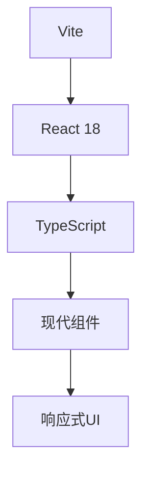
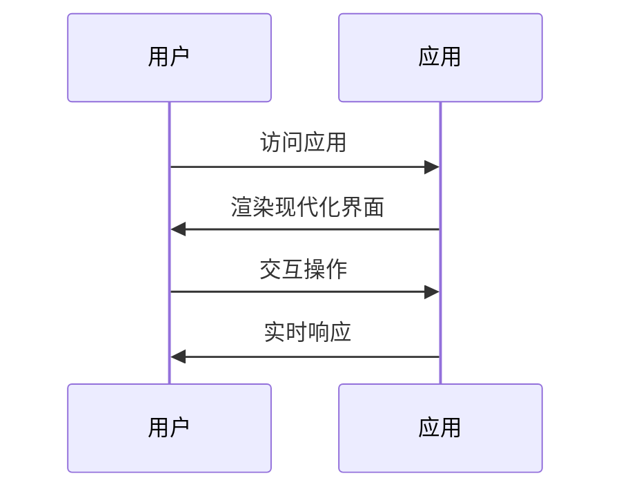

# Features

## 产品功能描述

### 核心功能
1. **响应式用户界面**
   - 现代化的React组件设计
   - 自适应布局支持
   - 流畅的用户交互体验

2. **快速开发体验**
   - Vite构建工具提供秒级热重载
   - TypeScript提供类型安全
   - 模块化组件架构

3. **AI生成背景音乐**
   - ElevenLabs API集成
   - 自动生成编程专注音乐
   - 循环播放环境音乐
   - 多种音乐风格选择

4. **性能优化**
   - 快速的冷启动
   - 优化的构建输出
   - 现代化的打包策略

## 技术实现

### 前端架构

### 用户流程

## 验收标准
- [ ] 应用能正常启动和运行
- [ ] 界面响应式设计完善
- [ ] TypeScript类型检查通过
- [ ] 构建输出优化
