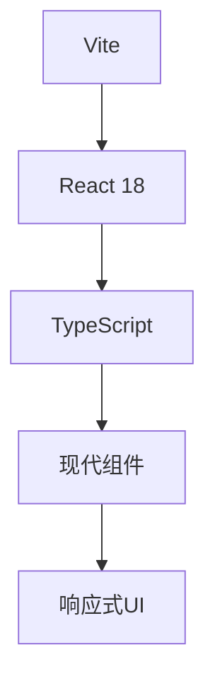
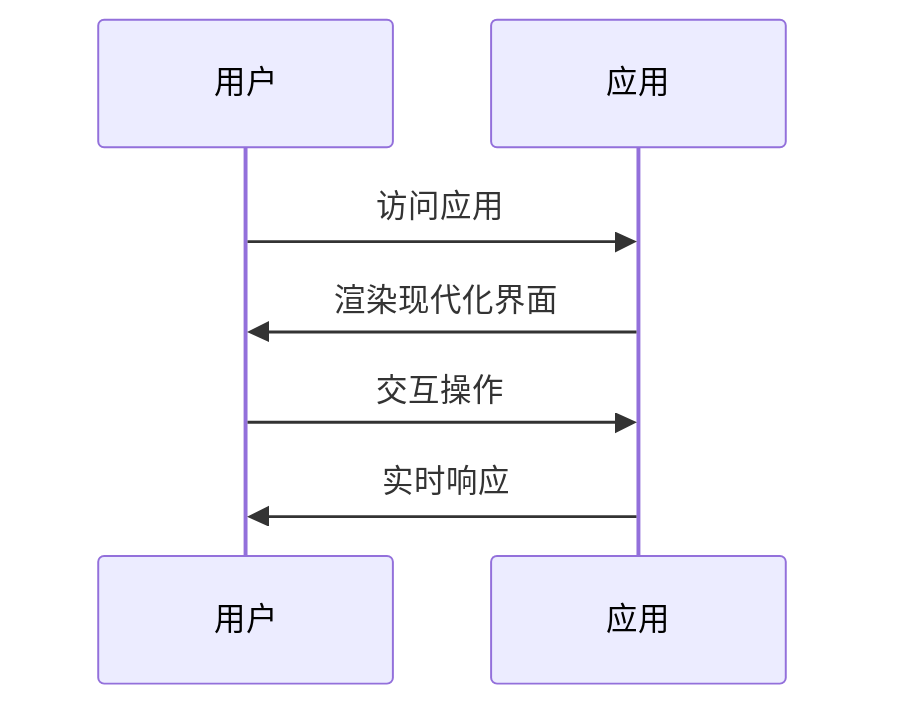

# Features

## 产品功能描述

### 核心功能
1. **AI音乐生成**
   - ElevenLabs API深度集成
   - 10种独特音乐风格自动切换
   - 30秒循环生成新音乐片段
   - 高质量MP3音频输出

2. **动态粒子视觉效果**
   - 150个实时动态粒子
   - 音乐播放状态驱动的视觉响应
   - HTML5 Canvas高性能渲染
   - 平滑的动画过渡效果

3. **沉浸式用户体验**
   - 玻璃拟态UI设计语言
   - 响应式音频可视化器
   - 直观的播放控制界面
   - 现代化渐变色彩方案

4. **技术架构优化**
   - Vite 6快速构建和热重载
   - React 18 Hooks优化性能
   - TypeScript完整类型安全
   - ESLint代码质量保证

## 技术实现

### 前端架构

### 用户流程

## 验收标准
- [ ] 应用能正常启动和运行
- [ ] 界面响应式设计完善
- [ ] TypeScript类型检查通过
- [ ] 构建输出优化
